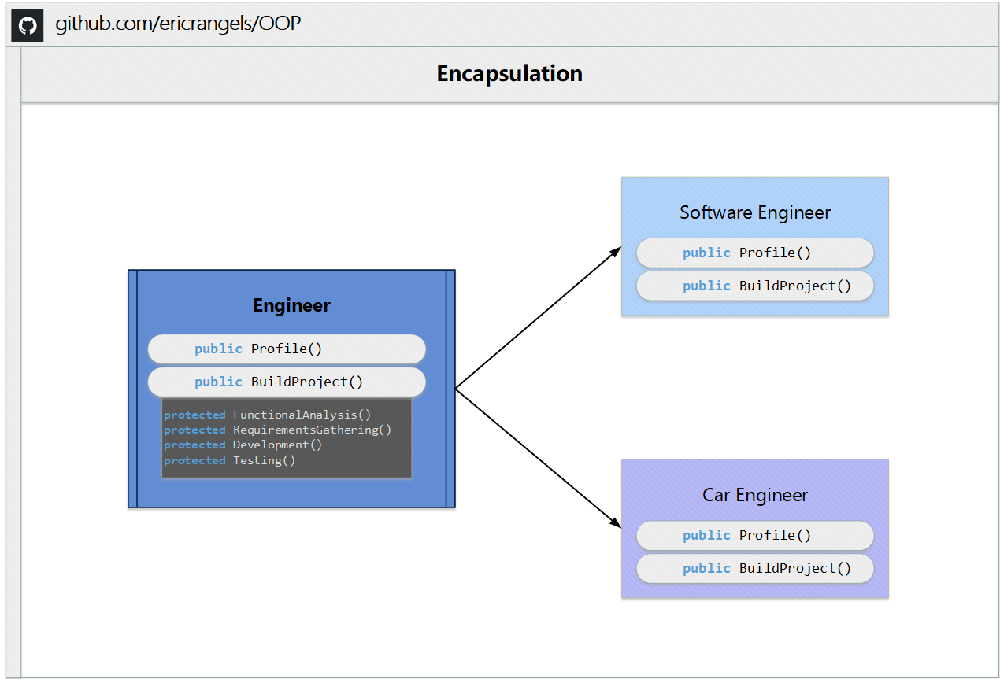

>What is OOP?

Object Oriented Programming (OOP) is a programming model where programs are organized around objects and data rather than action and logic.

OOP allows decomposition of a problem into a number of entities called objects and then builds data and functions around these objects. 
- The software is divided into a number of small units called objects. The data and functions are built around these objects.
- The data of the objects can be accessed only by the functions associated with that object.
- The functions of one object can access the functions of another object.

## 📌 Example of Encapsulation demonstrated in this project

