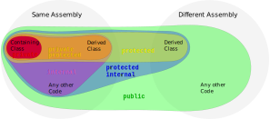

		

 

***

 
<h3 align="center"><strong>What is OOP (Object Oriented Programming)?</strong></h3>
 

> Object-oriented programming is a way of programming that enables developers to build things using entities or objects. 
In real life, people have the knowledge and can do several works. In OOP, objects have attributes to store information and can execute tasks (methods).

 

## ✏️ Basic

- Object:
>It’s the instance of a class or working entity of a class.
- Class:
>It is a template about the capability of what an object can do.
- Method:
>The behaviors of a class and tell what it can do.
- Instance:
>Objects are things in memory and instances are things that reference them.

 

***

 

## 🔍 Concepts

1. Encapsulation
2. Abstraction
3. Inheritance
4. Polymorphism

 

## 📦 Encapsulation

Encapsulation can be described as a protective barrier that prevents the code and data from being randomly accessed by other code defined outside the class. Access to the data and code is tightly controlled by a class.

The main purpose of encapsulation is you would have full control over data by using the code. In encapsulation, the variables of a class can be made hidden from other classes and can be accessed only through the methods of their current class. 
 
 
<h3 align="center"><strong>About Access Modifiers</strong></h3>
 

		

 
 
<h3 align="center"><strong>Example - Encapsulation presented in this OOP project</strong></h3>
 

		

 

## 👻 Abstraction

Abstraction is a process of hiding the implementation details from the user, only the functionality will be provided to the user.
In other words, the user will have the information on what the object does instead of how it does it.

By hiding complex steps/details/computations/statements inside your classes and creating public methods to access them. Ex: Wrapper Classes

 

## 🔗 Inheritance

Inheritance can be defined as the process where one class acquires the properties (methods and fields) of another.

In object-oriented programming, inheritance is when an object or class is based on another object (prototypal inheritance) or class (class-based inheritance), using the same implementation (inheriting from an object or class) specifying implementation to maintain the same behavior

The idea of inheritance implements is a relationship. For example, mammal IS-A animal, dog IS-A mammal hence dog IS-A animal as well.
 
 
<h3 align="center"><strong>Example - Inheritance presented in this OOP project</strong></h3>
 

		

 

## ⚔️ Polymorphism

In object-oriented programming, polymorphism is the characteristic of being able to assign a different meaning or usage to something in different contexts. 

It is specifically, to allow an entity such as a function, or an object to have more than one form.
 
 
<h3 align="center"><strong>Example - Inheritance presented in this OOP project</strong></h3>
 

		

